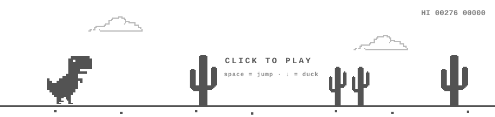

# README.md

---

> **"Science is what we understand well enough to explain to a computer. Art is everything else we do."**
>
> — Donald Knuth · *Things a Computer Scientist Rarely Talks About*

Tinkerer, open-the-box-to-see-how-it-works-er

---
### looking to connect?

